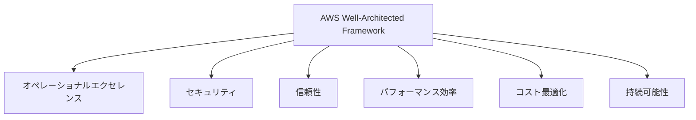
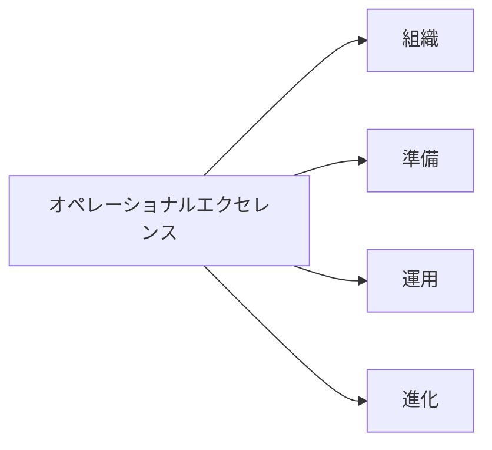
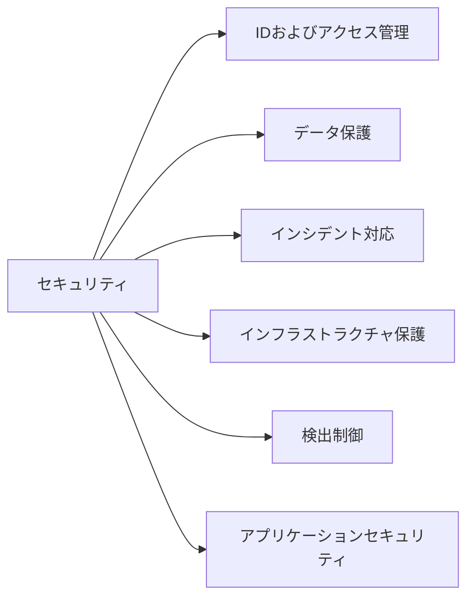
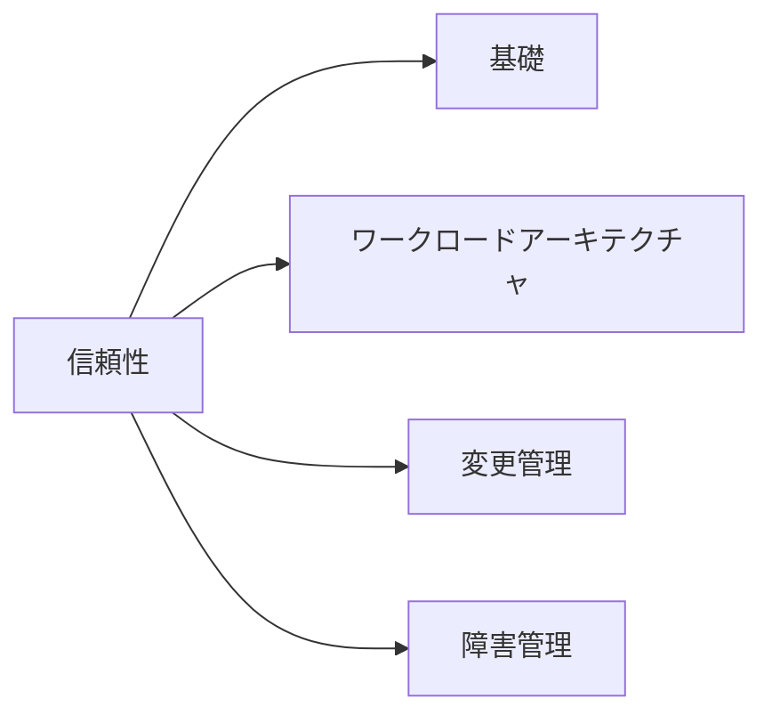
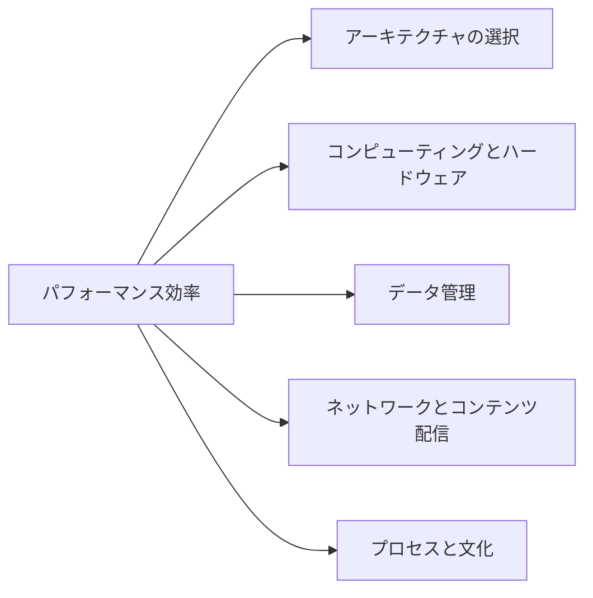
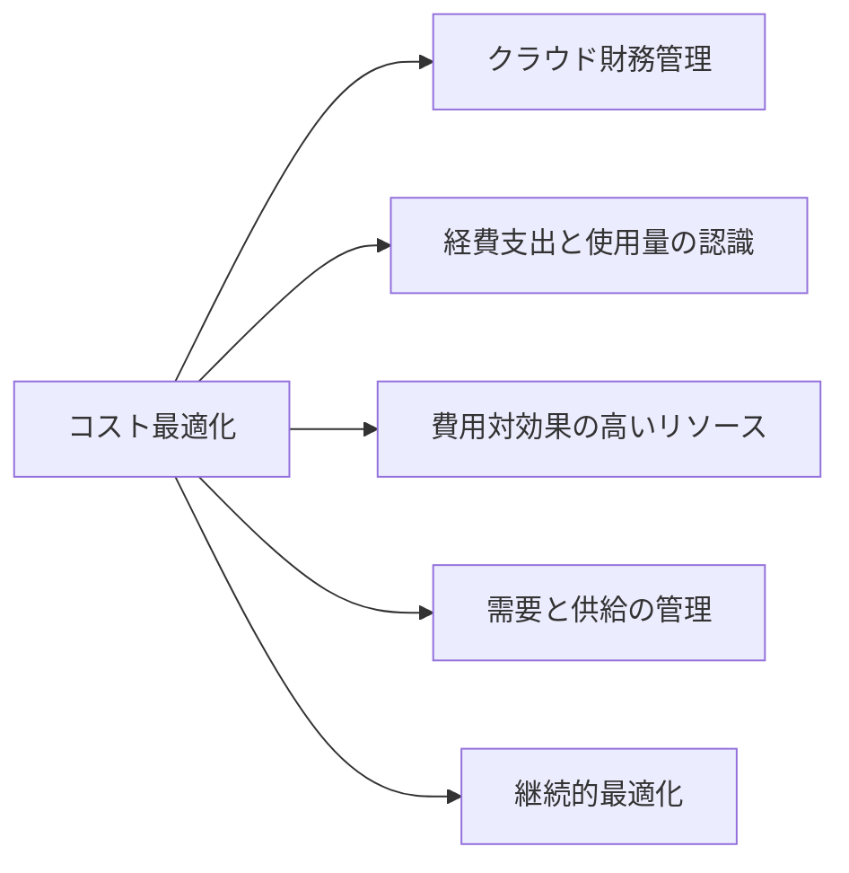
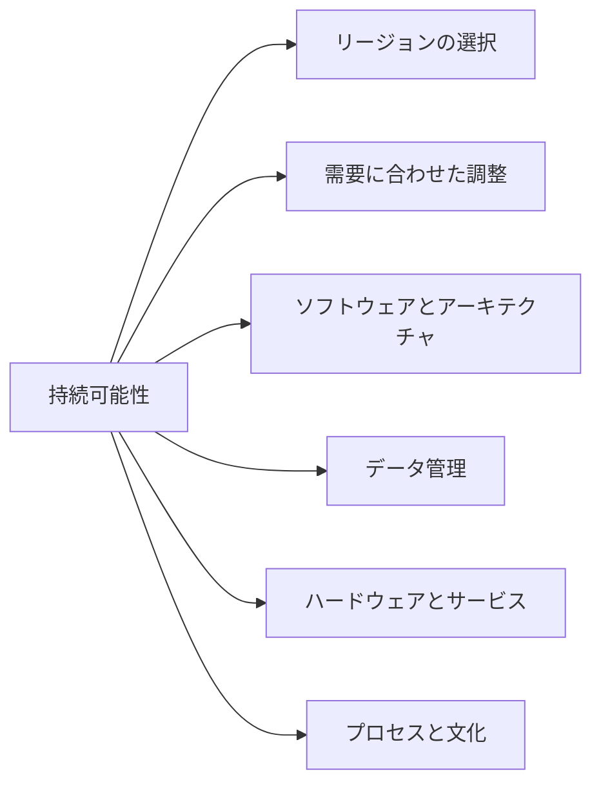

# AWS Well-Architected Framework サマリー

AWS Well-Architected Frameworkは、AWSクラウド上でシステムを構築する際の決定の長所と短所を理解し、信頼性が高く、効率的で、費用対効果の高い持続可能なクラウドアーキテクチャを設計・運用するためのベストプラクティス集です。このフレームワークは、AWSソリューションアーキテクトの長年の経験と、何千ものお客様のアーキテクチャ設計・レビューから得られた知見を集約しています。

## フレームワークの概要

AWS Well-Architected Frameworkは、クラウドアーキテクチャをベストプラクティスに照らして評価し、改善すべき分野を特定する一貫した方法を提供します。このフレームワークは、アーキテクチャの決定に関する建設的な議論を促進するためのツールであり、監査メカニズムではありません。

## 6つの柱

AWS Well-Architected Frameworkは、ソフトウェアシステムの構築をビルの建設に例えています。堅固な基礎がなければ、構造上の問題が発生し、ビルの健全性と機能が損なわれる可能性があります。同様に、クラウドアーキテクチャにおいても、6つの重要な柱を考慮せずに設計すると、要件に従って意図通りに稼働するシステムの構築は困難になります。

### 1. オペレーショナルエクセレンス

オペレーショナルエクセレンスとは、開発をサポートし、ワークロードを効率的に実行し、運用に関するインサイトを得て、ビジネス価値をもたらすサポートプロセスと手順を継続的に改善する能力を指します。

#### 設計原則

- コードによる運用の実現
- 小規模かつ可逆的な変更の頻繁な適用
- 運用手順の定期的な改善
- 失敗の予測と対応
- すべての運用上の失敗からの学習

#### ベストプラクティス領域

1. **組織**
   - チームの役割と責任の明確化
   - コミュニケーションチャネルの確立
   - フィードバックループの提供
   - クロスチームコラボレーションの促進

2. **準備**
   - 運用メトリクスの設計
   - 運用上の準備態勢のためのワークロード設計
   - 運用準備状況の評価
   - リスク管理と標準運用手順の文書化

3. **運用**
   - モニタリングとアラートの実装
   - イベント管理とインシデント対応
   - 変更管理と構成管理
   - 運用上の健全性の継続的な検証

4. **進化**
   - 学習と改善のためのメカニズム
   - 運用メトリクスとフィードバックループの共有
   - 実験と改善のための文化の構築
   - プロセスの継続的な最適化

#### 主なAWSサービス

| サービス | 用途 |
|---------|------|
| AWS CloudFormation | インフラストラクチャのコード化と自動化 |
| AWS Config | リソース設定の評価と監査 |
| AWS CloudTrail | API活動の記録と監査 |
| Amazon CloudWatch | モニタリング、ログ記録、アラート |
| AWS Systems Manager | 運用タスクの管理と自動化 |
| AWS Organizations | 複数のAWSアカウントの一元管理 |

### 2. セキュリティ

セキュリティの柱では、データ、システム、資産を保護し、クラウドテクノロジーを活用してセキュリティ体制を向上させる方法について説明しています。

#### 設計原則

- 強力なアイデンティティ基盤の実装
- トレーサビリティの実現
- すべての層でのセキュリティの適用
- セキュリティのベストプラクティスの自動化
- 転送中および保存中のデータの保護
- データへのアクセスの最小化と管理
- セキュリティイベントへの準備

#### ベストプラクティス領域

1. **IDおよびアクセス管理**
   - 最小特権の原則に基づくアクセス管理
   - きめ細かいアクセス制御と役割ベースのアクセス
   - 一時的な認証情報と定期的な認証情報のローテーション
   - 多要素認証(MFA)の強制

2. **データ保護**
   - データ分類の実装
   - 保存データの暗号化と保護
   - 転送中のデータの保護
   - データのバックアップと冗長性の確保

3. **インシデント対応**
   - インシデント対応プロセスの確立
   - フォレンジックケイパビリティの準備
   - 自動化された修復手順の実装
   - インシデントからの学習とフィードバックの取り込み

#### 主なAWSサービス

| サービス | 用途 |
|---------|------|
| AWS IAM | アクセス管理と権限制御 |
| Amazon GuardDuty | 脅威検出と継続的モニタリング |
| AWS Security Hub | セキュリティアラートの一元管理 |
| AWS KMS | 暗号化キーの管理 |
| AWS Shield | DDoS保護 |
| AWS WAF | Webアプリケーションファイアウォール |
| Amazon Inspector | 自動化されたセキュリティ評価 |

### 3. 信頼性

信頼性の柱には、ワークロードが意図した機能を期待通りに、正しく、一貫して実行する能力が含まれます。これにはワークロードのライフサイクル全体を通じて、運用やテストを行う能力も含まれています。

#### 設計原則

- 復旧手順のテスト
- 自動復旧の実装
- 水平方向のスケーリングによるシステム全体の可用性の向上
- キャパシティの推測を排除
- 変更の自動化
- 障害の分離

#### ベストプラクティス領域

1. **ワークロードアーキテクチャ**
   - 分散システム設計の原則の適用
   - 単一障害点の排除
   - 高可用性のためのマルチAZ配置
   - フォールトトレラントアーキテクチャの実装

2. **障害管理**
   - 障害の監視とアラート
   - 障害の自動復旧
   - データバックアップと災害復旧
   - 障害注入テスト

#### 主なAWSサービス

| サービス | 用途 |
|---------|------|
| Amazon Route 53 | 高可用性DNSと障害復旧 |
| Elastic Load Balancing | トラフィック分散と可用性向上 |
| AWS Auto Scaling | 需要に応じた自動スケーリング |
| Amazon RDS Multi-AZ | データベースの冗長化と自動フェイルオーバー |
| AWS Backup | 一元化されたバックアップ管理 |
| AWS Fault Injection Simulator | 制御された障害注入とレジリエンステスト |

### 4. パフォーマンス効率

パフォーマンス効率の柱では、クラウドリソースを効率的に使用してパフォーマンス要件を満たし、需要の変化や技術の進歩に合わせてこの効率性を維持する能力について説明しています。

#### 設計原則

- 最先端技術の優先的採用
- わずか数分でグローバル展開
- サーバーレスアーキテクチャの活用
- より頻繁な実験
- メカニカルシンパシー（システムの基盤となるハードウェアとソフトウェアの特性を理解する）
- データ駆動型の最適化

#### ベストプラクティス領域

1. **アーキテクチャの選択**
   - ワークロードの要件に最適なアーキテクチャアプローチ
   - マネージドサービスとサーバーレスオプションの活用
   - 目的に合わせた専用サービスの選択
   - 複合アーキテクチャの利点と課題のバランス

#### 主なAWSサービス

| サービス | 用途 |
|---------|------|
| Amazon EC2 | 様々なワークロード向けの計算リソース |
| AWS Lambda | サーバーレスコンピューティング |
| Amazon CloudFront | コンテンツ配信ネットワーク |
| Amazon ElastiCache | インメモリキャッシング |
| Amazon RDS | マネージドリレーショナルデータベース |
| AWS X-Ray | アプリケーションのパフォーマンス分析 |

### 5. コスト最適化

コスト最適化の柱は、最低価格でビジネス価値を実現するシステムを実行できる能力に焦点を当てています。この柱は、クラウド支出を管理・最適化し、コスト効率の良いリソースを使用して、コストを最小限に抑えながらビジネス成果を最大化する方法を提供します。

#### 設計原則

- クラウド財務管理の実践
- 消費モデルの導入
- 全体的な効率の測定
- 差別化につながらない重労働への支出停止
- 支出の分析と帰属

#### ベストプラクティス領域

1. **経費支出と使用量の認識**
   - コスト配分タグの実装
   - 詳細な使用状況レポートの設定
   - コスト異常の検出メカニズム
   - 予算とアラートの使用

#### 主なAWSサービス

| サービス | 用途 |
|---------|------|
| AWS Cost Explorer | コスト分析と可視化 |
| AWS Budgets | 予算設定とアラート |
| AWS Compute Optimizer | リソース最適化の推奨 |
| Reserved Instances & Savings Plans | 長期利用割引 |
| AWS Trusted Advisor | コスト最適化の推奨 |
| AWS Cost and Usage Report | 詳細なコストと使用状況データ |

### 6. 持続可能性

持続可能性の柱は、環境に対する影響、特にエネルギーの消費と効率性に焦点を当てています。この柱は、クラウドワークロードの環境への影響を最小限に抑え、エネルギー効率を最大化するための方法論と実践を提供します。

#### 設計原則

- 使用量の理解と環境への影響の最小化
- サステナビリティ目標の設定と達成のためのハイレベルな計画の利用
- リソース使用率の最大化によるデプロイの効率化
- マネージドサービスの活用
- データアクセスと保存パターンの最適化

#### ベストプラクティス領域

1. **需要に合わせた調整**
   - 需要パターンの分析と最適化
   - リソースの弾力的な供給
   - ユーザー行動に対するインセンティブ
   - 効率的なスケーリング戦略の実装

#### 主なAWSサービス

| サービス | 用途 |
|---------|------|
| AWS カーボンフットプリントツール | 環境影響の測定 |
| Amazon EC2 Auto Scaling | 需要に基づく効率的なリソース使用 |
| Amazon S3 Intelligent-Tiering | 使用パターンに基づくストレージ最適化 |
| AWS Graviton プロセッサ | エネルギー効率の高いコンピューティング |
| AWS Lambda | オンデマンドの効率的なコンピューティング |

## レビュープロセス

AWS Well-Architected Frameworkのレビュープロセスは、アーキテクチャを評価するための体系的なアプローチです。このプロセスは、非難のない建設的な環境で行われる対話型の方法であり、重大な問題や改善可能な領域を特定することを目的としています。

### レビューのタイミング

1. 設計の初期段階
2. 主要なマイルストーン
3. 本番稼働前
4. アーキテクチャ変更時

### レビュープロセスの特徴

- 簡易かつ効率的（数時間で完了）
- 非監査的で建設的な対話を促進
- 成果重視で具体的なアクションプランを作成

## 利用ツールとリソース

AWS Well-Architectedフレームワークを効果的に適用するための主なツールとリソース：

1. **AWS Well-Architected Tool (AWS WA Tool)**
   - アーキテクチャを一貫してレビューし、推奨事項を得るためのツール

2. **AWS Well-Architected Labs**
   - ベストプラクティスの実装をサポートする実践的なリソース

3. **AWS Well-Architectedパートナープログラム**
   - AWS Well-Architectedを活用したコンサルティングやレビューを提供するパートナー企業

4. **柱ごとのホワイトペーパー**
   - 各柱の詳細なガイダンスと実装手法を解説した文書

## まとめ

AWS Well-Architected Frameworkは、クラウドアーキテクチャの設計と運用のための包括的なベストプラクティス集です。6つの柱（オペレーショナルエクセレンス、セキュリティ、信頼性、パフォーマンス効率、コスト最適化、持続可能性）に基づき、クラウド環境での効果的なシステム構築をサポートします。

このフレームワークを活用することで、組織は安全で信頼性が高く、効率的で、コスト効果の高い持続可能なクラウドアーキテクチャを構築し、ビジネス価値を最大化することができます。また、継続的なレビューと改善を通じて、変化するビジネス要件や技術の進化に対応する柔軟性を確保できます。